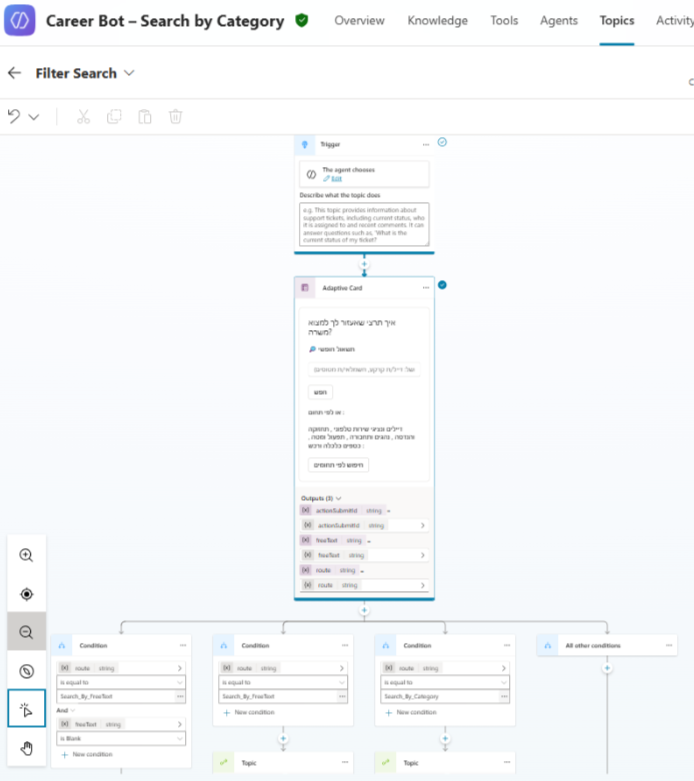

# Conversation Model

This document describes the **conversation design model**
used in the GenAI Career Agent solution.

The model combines **structured, deterministic flows**
with **free-text GenAI conversations**, allowing candidates
to move between precision-driven guidance and flexible inquiry
within a single conversational experience.

---

## Dual Interaction Model

The conversational experience supports two complementary modes:

- **Structured Domain Flow**
- **Free-Text Conversational Flow**

Both modes are available within the same Copilot Studio agent
and are designed to redirect users between each other
when appropriate, based on intent and context.

This dual model balances:
- Accuracy and control
- User flexibility and natural interaction

---

## Structured Domain Flow

The structured flow is designed for **accuracy, predictability,
and auditability**.

### Characteristics
- Domain-based entry points
- Deterministic eligibility questions
- Rule-driven decision logic
- Predictable and traceable outcomes

This flow is used when:
- Precise job matching is required
- Eligibility validation must be enforced
- Business rules must be applied consistently

---

## Free-Text Conversational Flow

The free-text flow supports **natural language interaction**
and exploratory questions.

### Characteristics
- Open-ended user questions
- Semantic understanding powered by GenAI
- Informational and explanatory responses
- Context-aware redirection back to the structured flow when needed

This mode enhances the user experience
while maintaining control over authoritative answers
and preventing uncontrolled decision-making.

---

## Conversation State Management

Conversation state is managed explicitly to ensure:

- Questions are not repeated unnecessarily
- User intent is preserved across turns
- Transitions between flows are consistent and predictable

State handling reduces confusion
and supports a coherent, guided user journey.

---

## Out-of-Scope and Fallback Handling

The conversation model includes explicit handling for:

- Questions outside supported job domains
- Requests for unavailable or future roles
- Incomplete, ambiguous, or unsupported user input

When such cases occur:
- Users are gently guided back to relevant conversation paths
- Or redirected to external career resources when appropriate

This ensures clarity without breaking the conversational experience.

---

## Summary

The conversation model emphasizes:

- Clear separation between deterministic logic and GenAI interaction
- Controlled transitions between structured and free-text flows
- Predictable behavior combined with a flexible user experience

This approach enables enterprise-grade reliability
while preserving an accessible and user-friendly conversational design.

