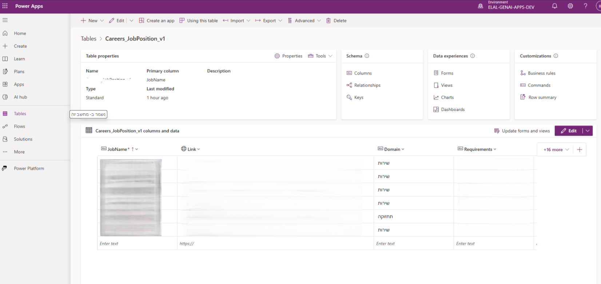

# Integration Patterns

This document outlines the **integration patterns**
used by Copilot Studio within the GenAI Career Agent solution.

The focus is on **interaction boundaries, responsibilities,
and controlled data flow**, rather than on low-level
implementation or configuration details.

---

## Integration with Dataverse

Dataverse serves as the **system of record**
for structured job, eligibility, and domain data.

Integration characteristics:
- Read-only access during conversation runtime
- Rule evaluation based on managed Dataverse tables
- Business-owned data updates without changes to conversation logic

This pattern ensures data accuracy,
predictable behavior, and operational independence
between business data and conversational design.

*(Example of Dataverse-based job metadata consumed by the structured agent.)*

---

## Integration with Power Automate

Power Automate is used to support **workflow orchestration**
and cross-platform actions that extend beyond the conversational layer.

Typical usage patterns:
- Triggering supporting workflows from Copilot Studio actions
- Integrating with Dataverse-based events
- Coordinating background processes without embedding logic in the agent

This approach keeps Copilot Studio focused on interaction,
while delegating operational workflows to dedicated automation flows.

---

## Integration with GenAI Services

Copilot Studio integrates with external **GenAI services**
to support free-text and exploratory conversations.

Key principles:
- GenAI is used for informational and explanatory interactions
- Deterministic logic is never delegated to LLMs
- Authoritative eligibility decisions remain rule-based

This separation prevents hallucinations
from influencing controlled decision outcomes.

---

## Redirection Between Interaction Modes

Integration patterns support **intentional and governed redirection**:

- From structured domain flow to GenAI for general or exploratory questions
- From GenAI back to structured flow when precise matching or validation is required

Transitions are controlled through:
- Conversation state
- Explicit user intent
- Defined handoff rules

This ensures a coherent and predictable user journey.

---

## External System Boundaries

Copilot Studio intentionally does **not**:
- Own business logic
- Store sensitive or authoritative data
- Perform eligibility calculations independently

Instead, it acts as:
- An orchestration layer
- A conversational interface
- A coordinator between structured data and AI capabilities

Responsibilities are delegated to the appropriate systems
(Dataverse, Power Automate, GenAI services) by design.

---

## Summary

The integration patterns ensure:
- Clear system and responsibility boundaries
- Controlled and limited use of GenAI
- Predictable, auditable conversational behavior
- Enterprise-ready conversational workflows
