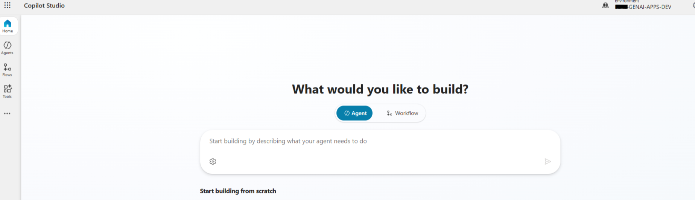

# Copilot Studio – Overview

This document describes the role of **Microsoft Copilot Studio**
within the Enterprise GenAI Career Agent solution.

Copilot Studio serves as the **primary conversational orchestration layer**
and user entry point, enabling both structured and free-text interactions
within a governed enterprise framework.

---

## Purpose of Copilot Studio

Copilot Studio is used to:
- Host the conversational experience
- Manage conversation flow and state
- Coordinate between deterministic logic and GenAI capabilities
- Integrate with enterprise data sources and services

It provides a controlled environment for building conversational agents
that align with organizational governance and security requirements.

---

## Position Within the Microsoft Ecosystem

Copilot Studio is part of the broader **Microsoft Power Platform**
and integrates natively with:
- Dataverse
- Power Apps
- Power Automate
- Microsoft 365 experiences

This enables conversational agents to operate consistently
across multiple Microsoft products and channels.

---

## Why Copilot Studio Was Selected

Copilot Studio was selected due to:
- Enterprise-grade governance and security
- Native integration with Dataverse
- Support for structured dialog and rule-based flows
- Controlled integration with GenAI capabilities
- Business-friendly extensibility without sacrificing oversight

These capabilities are especially suited
for eligibility-driven and career-related scenarios.

---

## Abstraction Level

This document focuses on **capabilities and responsibilities**,
not on implementation details.

Specific conversation logic, integration patterns,
and interaction models are documented
in the corresponding sections of this folder.

---

## Summary

Copilot Studio acts as the **conversational backbone** of the solution,
orchestrating user interactions while delegating logic,
data access, and AI processing to specialized components.

