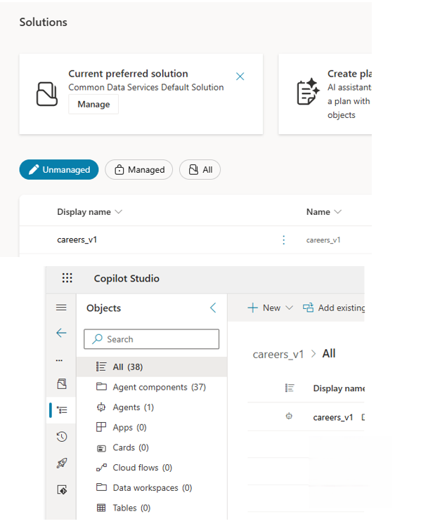

# Environments & Governance

This document outlines the **environment strategy**
and governance principles applied to the solution,
with a focus on enterprise-grade lifecycle management
within the Power Platform.

All descriptions are intentionally generic and sanitized.

---

## Environment Strategy

The solution is deployed across separate environments:

- **Development (DEV)** – active development and early testing
- **Testing / Validation (TEST)** – optional validation and acceptance testing
- **Production (PROD)** – stable runtime environment

Each environment is isolated
to ensure safe development and controlled releases,
and to prevent untested changes from impacting production users.

### Screenshot – Environment Separation
Add a single anonymized screenshot showing the list of Power Platform environments
(e.g. DEV / TEST / PROD), without tenant or organization details.

## Governance Principles

The following governance principles are applied across environments:

- Clear separation between environments
- Controlled access to data, agents, and flows
- Centralized management of configuration
- Promotion of changes using governed release processes
- Alignment with enterprise ALM practices

These principles ensure consistency, traceability,
and reduced operational risk.

---

## Solutions & ALM Control

All platform components are packaged and promoted using **Solutions**.

Solutions may include:
- Copilot Studio agents
- Power Automate flows
- Dataverse tables and schema
- Connection References

Production deployments rely on **managed solutions**
to enforce stability and prevent direct changes in PROD.

---

### Screenshot – Solutions & Release Model

Add one anonymized screenshot showing the Solutions list
(managed vs unmanaged), without organization-specific names.

 

## Roles & Access Control

A clear separation of responsibilities is maintained:

### Makers / Developers
- Build and test solutions in DEV
- No direct modification rights in PROD

### Admins / Release Owners
- Manage environments
- Control solution promotion
- Enforce governance policies

This model supports auditability
and controlled change management.

---

## Operational Control

Environment separation enables:
- Safe experimentation
- Predictable deployments
- Auditable changes
- Clear ownership of production stability

This structure supports long-term scalability
and organizational compliance.

---

## Summary

The environment and governance model ensures:
- Stable production operation
- Controlled and auditable releases
- Clear separation between development and runtime
- Enterprise-ready governance across the solution lifecycle

