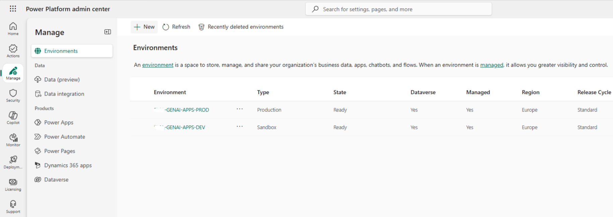

# Power Platform Overview

This document describes the role of the **Microsoft Power Platform**
within the GenAI Career Agent solution.

Power Platform provides the application,
data, and governance foundation
for the conversational experience.

---

## Role in the Solution
Power Platform is used to:
- Host the conversational agent
- Manage structured business data
- Support governance and environment separation
- Enable low-code extensibility

It serves as the backbone
for enterprise-grade conversational applications.

---

## Core Components Used
- **Copilot Studio** – Conversation orchestration
- **Dataverse** – Structured data storage
- **Power Platform environments** – Lifecycle management

These components operate together
to support a controlled and scalable solution.

---

## Summary
Power Platform enables rapid development
without compromising enterprise standards
for security, governance, and maintainability.
